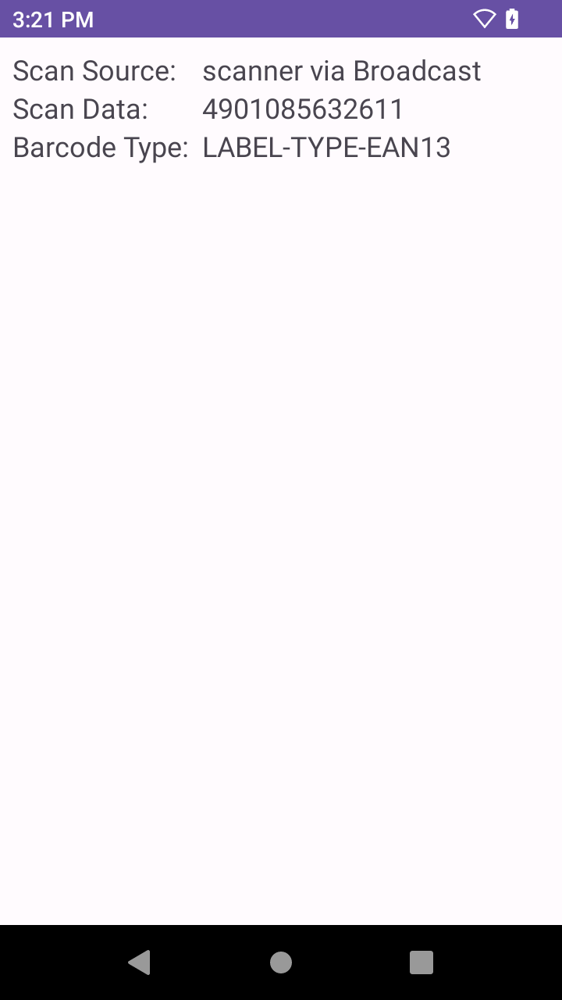

## Zebra Android端末でバーコードデータをDataWedge経由で取得する方法

Zebra Android端末（TC/EC）で単一バーコードを取得し、取得データを画面上に表示させるデモアプリ。Techdocsの説明ではわからない場合の参考資料としてご利用ください。

- DataWedge 経由でデータを取得
- BroadCast Intent を使用
- Android 13/ TC21にて動作確認

 

## アプリの利用方法

1. Demo-App.apkアプリをインストールする。（※）  
1. 下記リンクを参考にDataWedgeの設定をする。  
[Basic Intent in Java > Configuration](https://techdocs.zebra.com/datawedge/latest/guide/samples/basicintent1/)

※ お手元の環境で動作しない場合はソースコードを環境に合わせて修正し、再ビルドをお願いします。

 

## コードの詳細について

下記をご参照ください。

[Basic Intent in Java > Sample code walk-through](https://techdocs.zebra.com/datawedge/latest/guide/samples/basicintent1/)

 

## 画面イメージ

